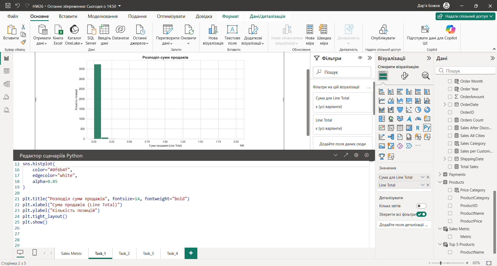
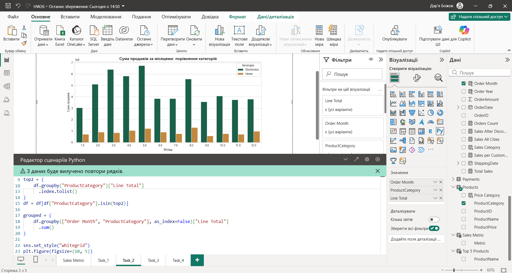
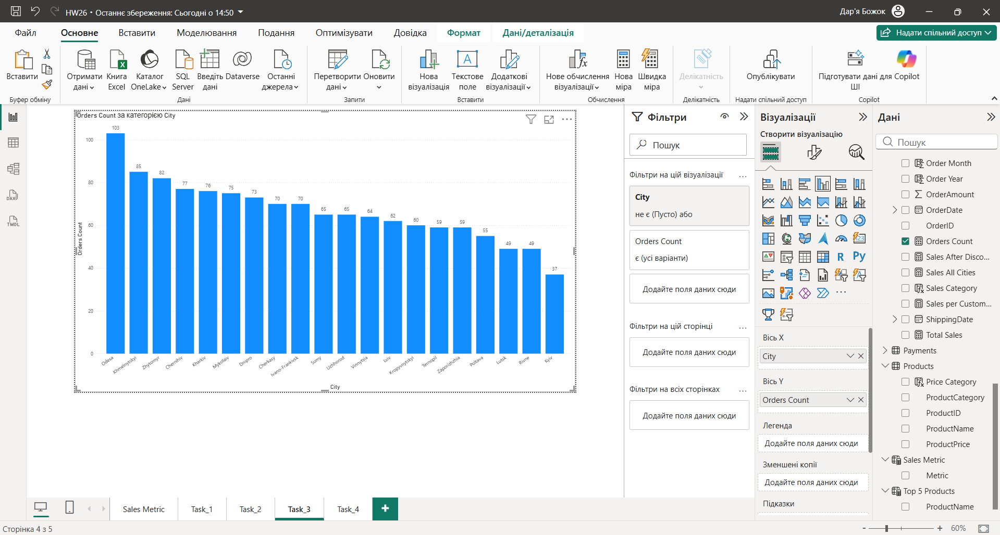
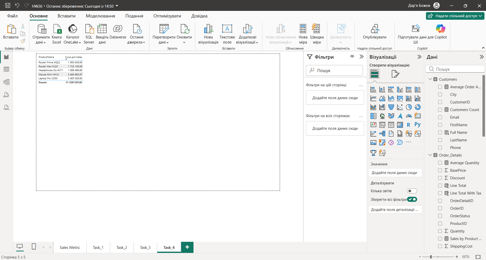

# E-commerce Sales Analytics

End-to-end analytics pipeline for an e-commerce dataset: from raw CSV exports to an
interactive Power BI report. Raw data is cleaned in Python, reshaped in Power Query,
modelled as a star schema, and measured with DAX.

**Stack:** Python (pandas) · Power Query · Power BI · DAX

---

## Problem

Sales data arrives as several disconnected CSV exports with missing values,
inconsistent text formatting and duplicated rows. In that state it cannot answer
basic business questions: which product categories drive revenue, which cities
generate the most orders, and how sales change month to month.

The goal was to build a repeatable pipeline that turns those exports into a single
model a non-technical user can explore without writing queries.

## Data

Six related tables: `Customers`, `Orders`, `Order_Details`, `Products`,
`Payments`, `Order_Metadata`.

## Pipeline

### 1. Cleaning in Python — [`python/clean_data.py`](python/clean_data.py)

- Missing names and cities filled with `Unknown` rather than dropping the rows, so
  sample size and revenue totals stay intact.
- Rows missing `ProductID` or `BasePrice` are dropped: a key and a price cannot be
  imputed without distorting every downstream metric.
- `Discount`, `ShippingCost` and `Tax` filled with `0`, since a missing value in
  these fields means the charge was not applied.
- Text fields trimmed and normalised to title case to prevent duplicate categories
  appearing in the report.
- Duplicates removed by primary key (`CustomerID`, `OrderDetailID`).
- Explicit type casting on all numeric and identifier columns.

### 2. Transformation in Power Query — [`power_query/transformations.md`](power_query/transformations.md)

Column typing, renaming, removal of unused fields, and shaping each table so it
loads into the model ready to relate. Documented table by table with screenshots.

### 3. Data model

Star schema built from the six tables in Power BI, with a separate disconnected
`Sales Metric` table used to switch the displayed KPI inside a single visual.

### 4. Measures — [`dax/measures.md`](dax/measures.md)

30 calculations grouped by purpose: base aggregations, averages and ratios,
filtered measures, filter-context removal with `ALL`, conditional tiers with
`SWITCH`, and calculated columns.

Examples of the patterns used:

- `DISTINCTCOUNT` for customer counts, so a repeat buyer is counted once
- `DIVIDE` instead of `/`, so an empty denominator returns blank rather than an error
- `CALCULATE` with `ALL(Customers[City])` to compare a city against the total
- `SWITCH(TRUE(), ...)` for discount and order-size tiers, kept readable as tiers grow

## Report

Four analytical pages plus a KPI overview with a metric selector.

**Sales distribution** — how order line totals are spread, built as a Python visual
inside Power BI.



**Monthly sales by category** — the two leading product categories compared across
the year.



**Orders by city** — order count ranked by city.



**Top products** — the five best-selling products by sales amount.



## Key findings

[1-2 речення з конкретикою: яка категорія дає найбільшу частку виручки,
які міста лідирують, чи видно сезонність.]

## Limitations

- The dataset is a static export, so the report reflects a fixed period rather than
  live data.
- Rows without a product key or base price were excluded, which slightly reduces the
  transaction count compared with the raw file.

## Repository structure

```
├── python/
│   └── clean_data.py           # cleaning of Customers and Order_Details
├── power_query/
│   └── transformations.md      # transformation steps with screenshots
├── dax/
│   └── measures.md             # every measure and calculated column
├── report/
│   └── sales_analytics.pbix    # Power BI report
├── images/                     # report and Power Query screenshots
└── data/sample/                # sample extract for reproducing the cleaning step
```

## How to run

```bash
pip install -r requirements.txt
python python/clean_data.py
```

The report can be opened from `report/sales_analytics.pbix` with Power BI Desktop.
