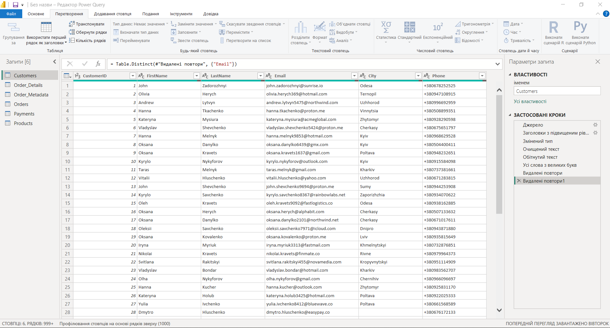
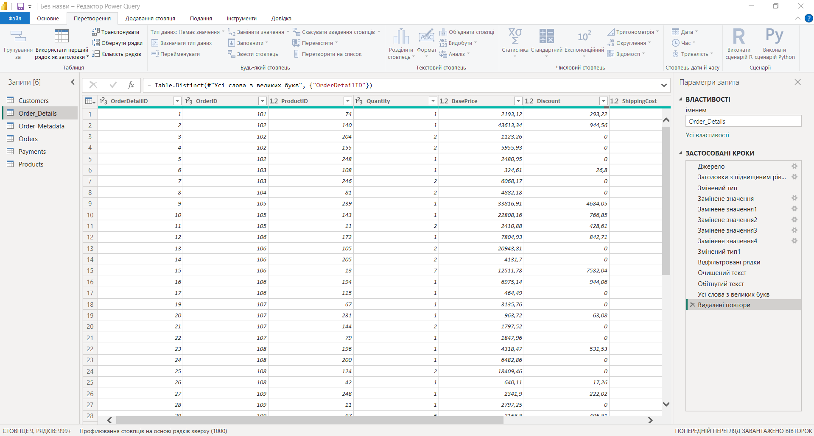
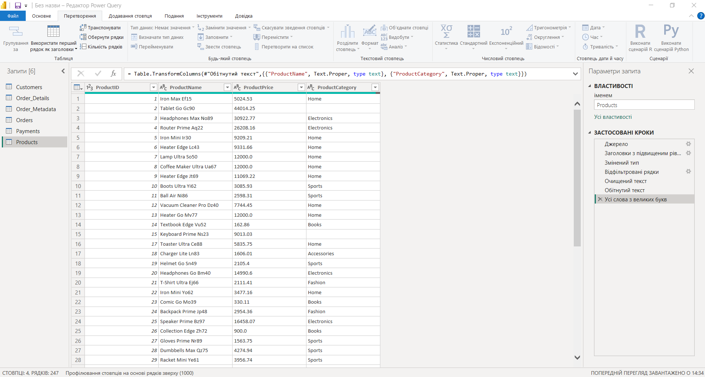
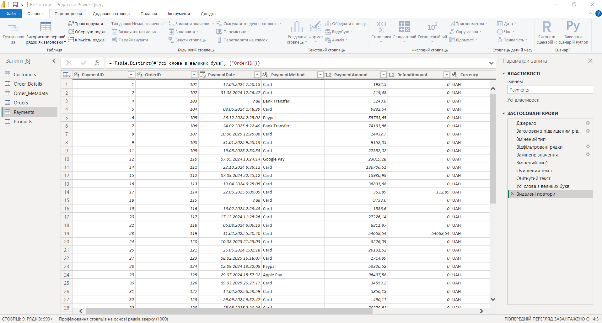
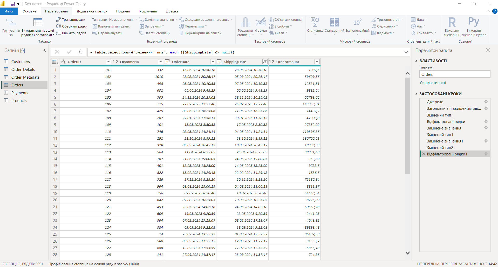
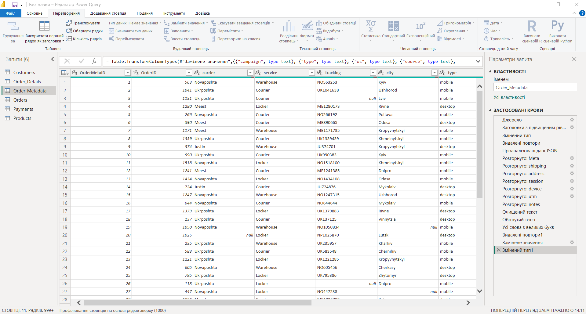

# Power Query Transformations

## Customers

Data types were set first. CustomerID was converted from text to whole number, since it is the key that relates Customers to Orders and a text key prevents the relationship from working. Phone went the other way, from number to text: a phone number is an identifier rather than a quantity, and as a numeric column it loses leading zeros and gets aggregated by default.

FirstName, LastName and City were trimmed of leading and trailing spaces and normalised to title case. Without this, values that look identical are treated as separate, and the same city appears twice in a slicer under different capitalisation.

Duplicates were removed on CustomerID and Email. Both have to be unique; duplicates would double-count customers and distort every per-customer metric.

## Order_Details

OrderDetailID, OrderID and Quantity were converted from text to whole number. ProductID, BasePrice, Discount, ShippingCost and Tax had their decimal separator replaced before being converted to decimal, because the source used a separator the locale did not recognise and the columns loaded as text.

Rows with null in BasePrice and ProductID were removed. Neither a price nor a product key can be imputed, and keeping those rows would distort every revenue calculation built on top of them.

OrderStatus was trimmed and normalised to title case, since it is used as a filter and inconsistent casing would split one status into several.

Duplicates were removed on OrderDetailID, which is the primary key of the table and must be unique.

## Products

Rows with an empty ProductPrice were removed, since price is a required attribute and a product without one cannot take part in any revenue calculation.

ProductName and ProductCategory were trimmed and normalised to title case, so that the same category does not appear several times in the report.

 

## Payments

Rows with an empty OrderID were removed: a payment with no order attached cannot be matched to anything and would only add noise. Rows with a missing ShippingDate were removed as well.

OrderID, PaymentAmount and RefundAmount had their decimal separator replaced and were converted to decimal. OrderID was then converted from decimal to whole number, since it is a key and has to match the integer key on the Orders side.

PaymentMethod and PaymentStatus were trimmed and normalised to title case, as both are used as filters in the report.

Duplicates were removed on OrderID.

 

## Orders

Empty cells were removed from CustomerID, since an order that cannot be attributed to a customer breaks the relationship to the Customers table. The decimal separator was replaced in that column and the type converted.

OrderAmount had its separator replaced and was converted to decimal, so that order values could be aggregated.

 

## Order_Metadata

The Meta column packed nine attributes into a single string, so nothing inside it could be filtered or grouped. It was split into carrier, service, tracking, city, type, os, source, campaign and notes.

carrier, service and city were then trimmed and normalised to title case, for the same reason as the text columns in Customers.

Duplicates were removed on OrderID.

In notes, null was replaced with an explicit "not specified" marker rather than being left empty. Marking a missing value keeps the row in the dataset and makes the gap visible in the report, instead of silently dropping it from counts.

tracking, type, os, source, campaign and notes were set to text type.

 

